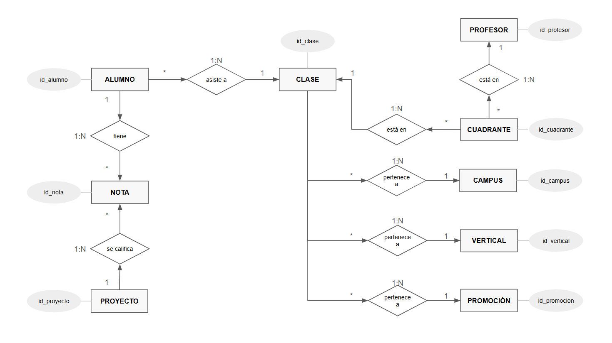

# Proyecto de bases de datos SQL:

| Alumno | Proyecto_BBDD |
|-----|------|
| Ana | No Apto |
| Antton | No Apto |
| Leire| No Apto|
| Maider | No Apto |
| Xabi | No Apto |

Proyecto de Creación de Base de Datos Relacional 

## INTRODUCCIÓN 

Este proyecto trata de la creación de una base de datos relacional a partir de los datos proporcionados en 5 archivos .csv. Los datos se refieren a un grupo de estudiantes de una escuela de bootcamps junto con el claustro de profesores. 

 

## DATOS DE ENTRADA 

Los datos proporcionados en cada archivo .csv son los siguientes: 

Clase_1.csv y clase_2.csv: 

- Nombre 

- Email 

- Promoción (mes) 

- Fecha_comienzo (DD/MM/AAAA) 

- Campus (ciudad) 

- Proyecto_HLF (Apto/No apto) 

- Proyecto_EDA (Apto/No apto) 

- Proyecto_BBDD (Apto/No apto) 

- Proyecto_ML (Apto/No apto) 

- Proyecto_Deployment (Apto/No apto) 

Clase_3.csv y clase_4.csv: 

- Nombre; 

- Email; 

- Promoción; 

- Fecha_comienzo; 

- Campus; 

- Proyecto_WebDev; 

- Proyecto_FrontEnd; 

- Proyecto_Backend; 

- Proyecto_React; 

- Proyecto_FullSatck 

Claustro.csv: 

- Nombre 

- Rol (TA/  LI) 

- Vertical (DS/FS) 

- Promocion (mes) 

- Campus (ciudad) 

- Modalidad (Online/Presencial) 

 

## ETAPAS DEL PROYECTO 

Modelo Entidad-Relación (E/R): Diseñar un modelo E/R que represente la estructura de la base de datos normalizada. Definir las entidades, atributos y relaciones entre ellas. 

Modelo Lógico de la Base de Datos: Con base en el modelo E/R, desarrollar un modelo lógico de la base de datos. Esto implica definir la estructura de las tablas y sus campos, así como las claves primarias y foráneas necesarias. 

Normalización de Datos: Analizar los datos y realizar una normalización adecuada para eliminar la redundancia y garantizar la integridad de los datos. 

Creación de la Base de Datos: Utilizando un sistema de gestión de bases de datos de PostgreSQL, crEar la base de datos y las tablas necesarias según el modelo lógico. Crear las queries necesarias para crear las tablas e ingestar los datos. Habrá que alojar en algún servidor vuestras bases de datos para poder acceder desde aplicaciones de terceros. Algún servicio gratis de postgreSQL: 

Render 

Se deberá de tener en cuenta la escalabilidad de la base de datos. Es decir, tiene que ser capaz de poder crecer en campus (Madrid, Valencia,...), verticales (DS, FS,...), promociones (Septiembre, Febrero,...), Modalidad (Online, Presencial,...), aulas, etc... 

## ENTREGABLES 

Diagrama del modelo Entidad-Relación (E/R). 

Diagrama del modelo lógico de la base de datos. 

Scripts SQL o comandos utilizados para crear la base de datos y las tablas. 

Base de datos funcional con los datos importados y consumibles con queries de consulta. 

Se deberá mostrar la base de datos ingestada según la solución propuesta y una serie de queries de consulta como demo de funcionamiento de la base de datos. 

 

## DIAGRAMA DEL MODELO ENTIDAD-RELACIÓN (E/R) 

Un diagrama ERD es una herramienta visual que permite modelar las relaciones entre las entidades de un sistema, facilitando el diseño de bases de datos y la comprensión de la estructura de la información.   

Para este proyecto el diagrama planteado es el siguiente: 

GRAFICO

Retos encontrados: 

Se han creado 8 tablas que recogen todas las variables de las tablas. 

Clase-Profesor es N:M: se ha tenido que crear una tabla intermedia que se ha llamado CUADRANTE. Así todas las conexiones son 1:N 

 

## DIAGRAMA DEL MODELO LÓGICO DE LA BASE DE DATOS: 

Un diagrama del modelo lógico de una base de datos muestra la estructura conceptual de la información almacenada, incluyendo las entidades, atributos y relaciones entre ellas, sin especificar la tecnología o implementación concreta. Este diagrama es una herramienta esencial para comprender cómo se organiza y se relaciona la información en una base de datos, permitiendo identificar problemas y optimizar el diseño.   

Para este proyecto el diagrama planteado es el siguiente: 

GRAFICO

## SCRIPTS SQL O COMANDOS UTILIZADOS PARA CREAR LA BASE DE DATOS Y LAS TABLAS 

  -Se crean las tablas ya definidas, con:
    -tipo de datos
    -longitud
    -primary key
    -cómo se relacionan las keys de unas tablas con otras

  - Se cargan los 5 archivos.csv y se pasan a 5 dataframes: df1, df2, df3, df4 y df_claustro
  - Se crea un dataframe llamado df_total con los df1, df2, df3 y df4.
  - Primero se generan los DF que se generan facilmente con los datos de los CSV
  - Despues se generan los DF que tienen mas keys, mas vinculaciones con otras tablas.
  - Los DF que se generan son:
       -VERTICAL
       -PROMOCIÓN
       -CAMPUS
       -PROYECTO
       -PROFESORADO
       -CLASE
       -CUADRANTE
       -ALUMNOS
       -NOTAS
    - La programación de esos FS se hace 

    
 

 

## BASE DE DATOS FUNCIONAL CON LOS DATOS IMPORTADOS Y CONSUMIBLES CON QUERIES DE CONSULTA 

 

 
