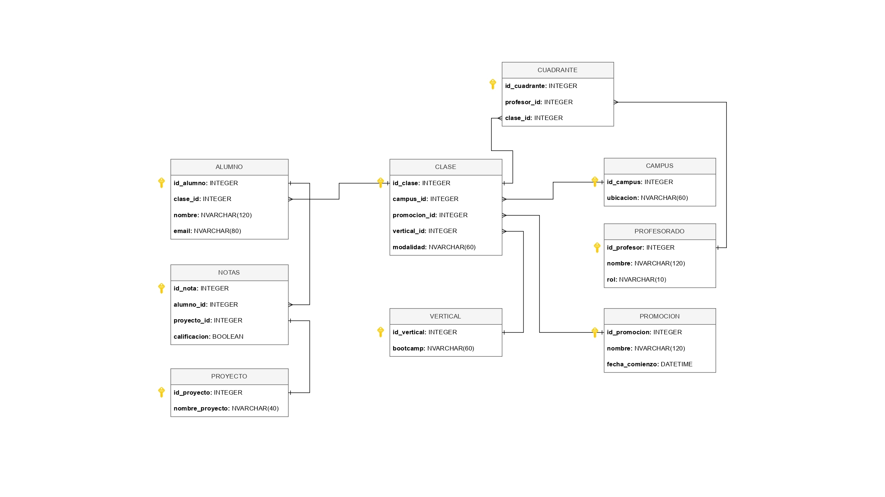

# PROYECTO DE CREACIÓN DE BASE DE DATOS RELACIONAL SQL

## INTRODUCCIÓN 

Este proyecto trata de la creación de una base de datos relacional a partir de los datos proporcionados en 5 archivos .csv. Los datos se refieren a un grupo de estudiantes de una escuela de bootcamps junto con el claustro de profesores. 

 

## DATOS DE ENTRADA 

Los datos proporcionados en cada archivo .csv son los siguientes: 

Clase_1.csv y clase_2.csv: 

- Nombre 

- Email 

- Promoción (mes) 

- Fecha_comienzo (DD/MM/AAAA) 

- Campus (ciudad) 

- Proyecto_HLF (Apto/No apto) 

- Proyecto_EDA (Apto/No apto) 

- Proyecto_BBDD (Apto/No apto) 

- Proyecto_ML (Apto/No apto) 

- Proyecto_Deployment (Apto/No apto) 

Clase_3.csv y clase_4.csv: 

- Nombre

- Email 

- Promoción 

- Fecha_comienzo

- Campus

- Proyecto_WebDev 

- Proyecto_FrontEnd

- Proyecto_Backend 

- Proyecto_React 

- Proyecto_FullSatck 

Claustro.csv: 

- Nombre 

- Rol (TA/  LI) 

- Vertical (DS/FS) 

- Promocion (mes) 

- Campus (ciudad) 

- Modalidad (Online/Presencial) 

 

## ETAPAS DEL PROYECTO 

El proyecto comprende las siguinetes etapas:
- Modelo Entidad-Relación (E/R): Diseñar un modelo E/R que represente la estructura de la base de datos normalizada. Definir las entidades, atributos y relaciones entre ellas. 

- Modelo Lógico de la Base de Datos: Con base en el modelo E/R, desarrollar un modelo lógico de la base de datos. Esto implica definir la estructura de las tablas y sus campos, así como las claves primarias y foráneas necesarias. 

- Normalización de Datos: Analizar los datos y realizar una normalización adecuada para eliminar la redundancia y garantizar la integridad de los datos. 

- Creación de la Base de Datos: Utilizando un sistema de gestión de bases de datos de PostgreSQL, crEar la base de datos y las tablas necesarias según el modelo lógico. Crear las queries necesarias para crear las tablas e ingestar los datos. Habrá que alojar en algún servidor vuestras bases de datos para poder acceder desde aplicaciones de terceros. Con Render. 

  *Se deberá de tener en cuenta la escalabilidad de la base de datos. Es decir, tiene que ser capaz de poder crecer en campus (Madrid, Valencia,...), verticales (DS, FS,...), promociones (Septiembre, Febrero,...), Modalidad (Online, Presencial,...), aulas, etc... 

## ENTREGABLES 

- Diagrama del modelo Entidad-Relación (E/R). 

- Diagrama del modelo lógico de la base de datos. 

- Scripts SQL o comandos utilizados para crear la base de datos y las tablas. 

- Base de datos funcional con los datos importados y consumibles con queries de consulta. 

- Se deberá mostrar la base de datos ingestada según la solución propuesta y una serie de queries de consulta como demo de funcionamiento de la base de datos. 

 

## DIAGRAMA DEL MODELO ENTIDAD-RELACIÓN (E/R) 

Un diagrama ERD es una herramienta visual que permite modelar las relaciones entre las entidades de un sistema, facilitando el diseño de bases de datos y la comprensión de la estructura de la información.   

Para este proyecto el diagrama planteado es el siguiente: 

Retos encontrados: 

Inicialmente se han creado 8 tablas que recogen todas las variables de las tablas. 

Clase-Profesor es N:M y por lo tanto se ha tenido que crear una tabla intermedia que se ha llamado CUADRANTE. Así todas las conexiones son 1:N. 

 

## DIAGRAMA DEL MODELO LÓGICO DE LA BASE DE DATOS: 

Un diagrama del modelo lógico de una base de datos muestra la estructura conceptual de la información almacenada, incluyendo las entidades, atributos y relaciones entre ellas, sin especificar la tecnología o implementación concreta. Este diagrama es una herramienta esencial para comprender cómo se organiza y se relaciona la información en una base de datos, permitiendo identificar problemas y optimizar el diseño.   

Para este proyecto el diagrama planteado es el siguiente: 

## SCRIPTS SQL O COMANDOS UTILIZADOS PARA CREAR LA BASE DE DATOS Y LAS TABLAS 

  -Se crean las tablas ya definidas, con:
    -tipo de datos
    -longitud
    -primary key
    -cómo se relacionan las keys de unas tablas con otras

  - Se cargan los 5 archivos.csv y se pasan a 5 dataframes: df1, df2, df3, df4 y df_claustro
       df1 = pd.read_csv("data/clase_1.csv", sep = ';')
       df2 = pd.read_csv("data/clase_2.csv", sep = ';')
       df3 = pd.read_csv("data/clase_3.csv", sep = ';')
       df4 = pd.read_csv("data/clase_4.csv", sep = ';')
       df_claustro = pd.read_csv("data/claustro.csv", sep = ';')
    
  - Se crea un dataframe llamado df_total con los df1, df2, df3 y df4.
       df_total = pd.concat([df1, df2, df3, df4], ignore_index = True)
    
  - Primero se generan los DF que se generan facilmente con los datos de los CSV.
       Ejemplo:

          df_vertical = pd.DataFrame({
           "bootcamp": df_claustro["Vertical"].unique()
       })
       df_vertical.reset_index(names = "id_vertical", inplace = True)
    
  - Despues se generan los DF que tienen mas keys, más vinculaciones con otras tablas.
  - Los DF que se generan son:

    
       -VERTICAL
    
       -PROMOCIÓN
    
       -CAMPUS
    
       -PROYECTO
    
       -PROFESORADO
    
       -CLASE
    
       -CUADRANTE
    
       -ALUMNOS
    
       -NOTAS
    
    
## BASE DE DATOS FUNCIONAL CON LOS DATOS IMPORTADOS Y CONSUMIBLES CON QUERIES DE CONSULTA 

Una vez finalizada la elaboración de los nueve DataFrames en el entorno de trabajo, se procede a la exportación de cada uno de ellos como archivos .CSV. Esta acción permite contar con una estructura de datos estandarizada, portable y compatible con múltiples sistemas de gestión de bases de datos.

Posteriormente, estos archivos .CSV se utilizan como fuente para la creación de una base de datos relacional en PostgreSQL, mediante la interfaz gráfica de administración PgAdmin4. Este entorno facilita la importación de datos, el diseño del esquema relacional, y la posterior ejecución de consultas SQL para la exploración, análisis y explotación de los datos.

El resultado es una base de datos funcional, estructurada y optimizada para ser consultada mediante sentencias SQL, lo que permite obtener información específica, generar informes y realizar análisis avanzados sobre los datos recopilados.

 
